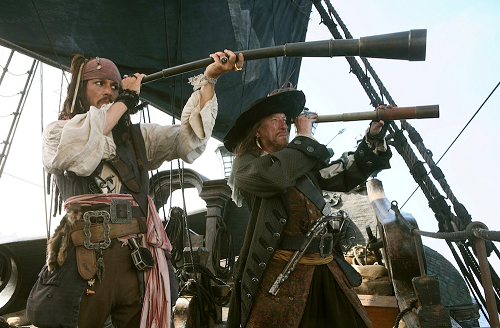
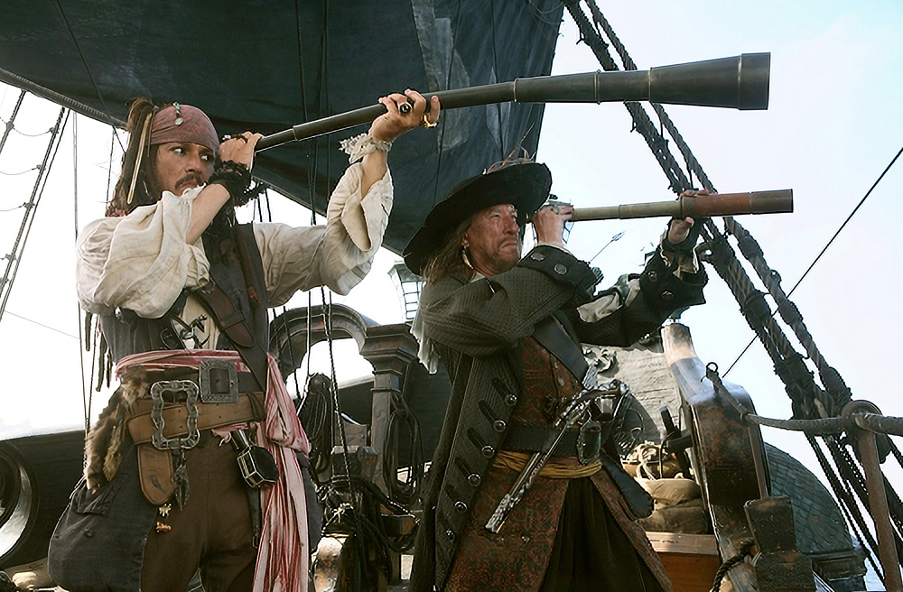
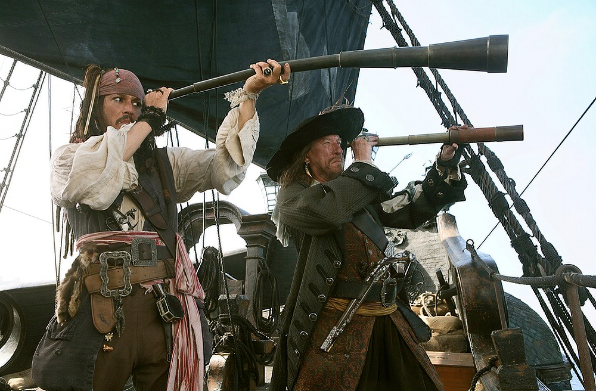
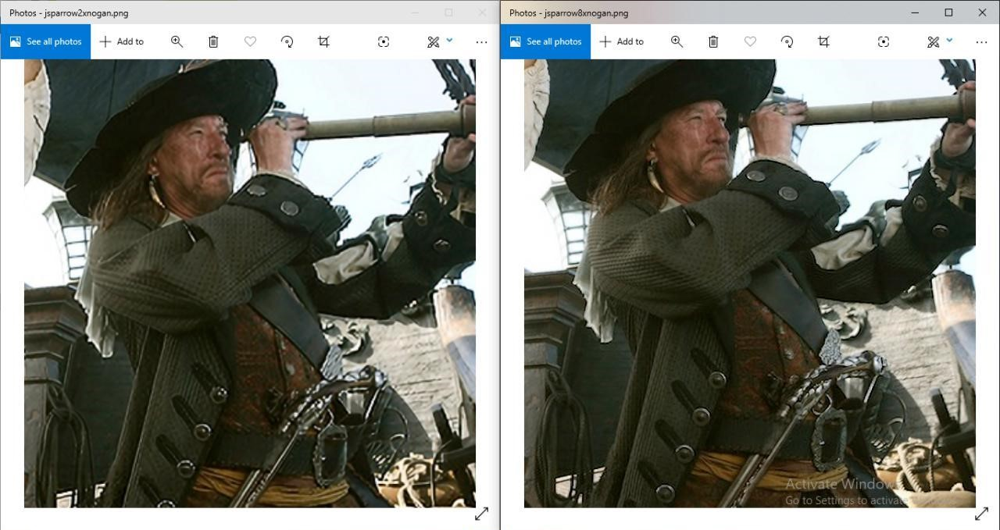

# Example outputs
outputs from the ProSR and ProGANSR models at various configs
## Captain Jack Sparrow
### Input Image

### 2x ProSR Upscaled Image

### 2x ProGANSR Upscaled Image

### 2x ProSR vs 8x ProSR

### more examples will be added soon..
